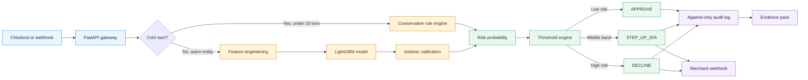
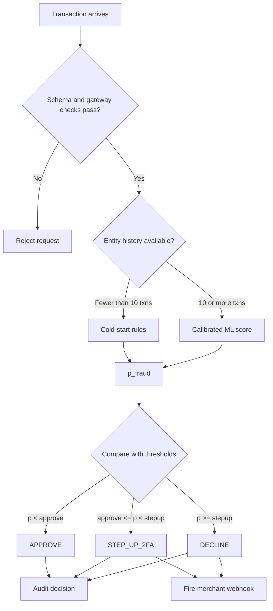
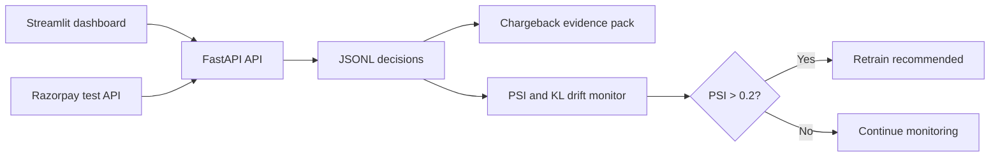
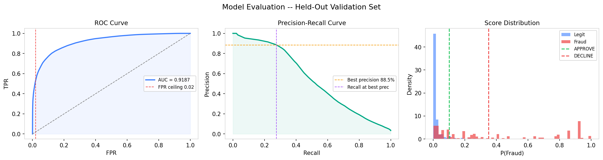
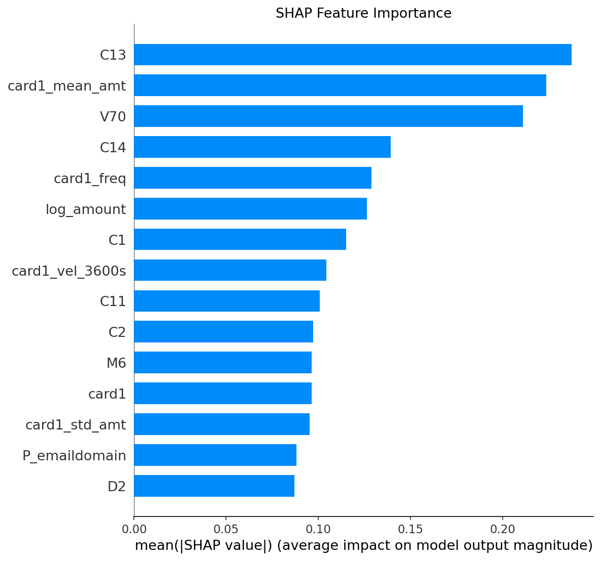
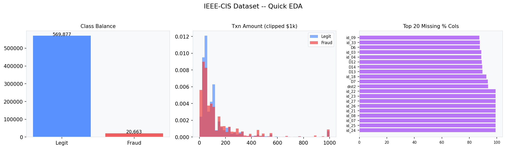

<div align="center">


<br />

# RiskPulse

<h3><strong>End-to-End MLOps Pipeline for Low-Latency Transaction Scoring and Continuous Model Monitoring</strong></h3>

<sub>Track 02 — AI Risk Manager &nbsp;·&nbsp; AI Buildathon 2026</sub>

<br />


<br />

<table>
  <tr>
    <td align="center" width="340">
      <strong>Live Dashboard</strong><br />
      <sub>Streamlit ops panel — real-time fraud monitoring, scoring, and drift detection</sub><br /><br />
      <a href="https://riskpulse-dashboard.onrender.com">
        
      </a>
    </td>
    <td align="center" width="340">
      <strong>Live API</strong><br />
      <sub>FastAPI inference server — /score, /batch, /audit, /health endpoints</sub><br /><br />
      <a href="https://riskpulse-api-jkd4.onrender.com">
        
      </a>
    </td>
  </tr>
</table>

</div>

---

## Table of Contents

- [Overview](#overview)
- [Architecture](#architecture)
- [Evaluation Metrics](#evaluation-metrics)
- [Project Structure](#project-structure)
- [Quick Start](#quick-start)
- [API Reference](#api-reference)
- [Dashboard](#dashboard)
- [Features](#features)
- [Test Suite](#test-suite)
- [Cold-Start Handling](#cold-start-handling)
- [Drift Detection](#drift-detection)
- [Model Training](#model-training)
- [Tech Stack](#tech-stack)
- [Docker Deployment](#docker-deployment)
- [Environment Variables](#environment-variables)
- [Implementation Status](#implementation-status)
- [Author](#author)

---

## Overview

RiskPulse is a production-grade fraud detection system that scores transactions in real time, generates explainable decisions with SHAP reason codes, and integrates directly with Razorpay's test-mode API. Every decision is logged to an immutable audit trail and can be exported as a chargeback evidence pack.

The system handles the full fraud detection lifecycle — from transaction ingestion and feature engineering, through ML inference and threshold routing, to merchant webhook delivery and drift monitoring.

| Signal | Value |
|---|---|
| **Fraud model** | LightGBM + isotonic calibration |
| **Decision paths** | ML inference or conservative cold-start rules |
| **Outputs** | Approve, step up with 2FA, or decline |
| **Controls** | Explainable reasons, immutable audit, drift monitoring |
| **Interfaces** | FastAPI, Streamlit, Razorpay test mode |

> **Important:** This project is configured for Razorpay **test mode**. Use test credentials in `.env` and never commit secrets.

---

## Architecture

The scoring path keeps low-history entities conservative while giving established entities the full calibrated model path.

### Scoring Pipeline



### Decision Routing



### Operating Model



---

## Evaluation Metrics

Evaluated on the IEEE-CIS Fraud Detection dataset — **118,108 validation transactions**

| Metric | HIGH_PRECISION | BALANCED |
|---|---|---|
| AUC-ROC | 0.9187 | 0.9187 |
| Precision | 0.8854 | 0.7047 |
| Recall | 0.2756 | 0.4011 |
| False Positive Rate | 0.0013 | 0.0060 |
| F1 Score | 0.4198 | 0.5117 |

**Combined fraud coverage:** 66.6% of all fraud addressed (40.1% hard declined + 26.5% routed to 2FA)

**False positives in HIGH_PRECISION mode:** 145 transactions wrongly declined out of 114,044 (0.13%)

**Model:** LightGBM 3129 trees, 451 features, isotonic calibration

**Training data:** 472,432 transactions &nbsp;|&nbsp; **Validation data:** 118,108 transactions

<br />

<div align="center">

<br /><sub>Precision–recall, ROC, and threshold distribution across HIGH_PRECISION and BALANCED modes</sub>
</div>

---

## Project Structure

```
razorpay-ai-risk-manager/
├── api/
│   └── main.py                  FastAPI inference server
├── artifacts/
│   ├── lgbm_risk_model.txt      LightGBM model (3129 trees)
│   └── model_metadata.json      Model metadata and thresholds
├── audit/
│   ├── __init__.py
│   ├── logger.py                Append-only JSONL audit trail
│   └── evidence.py             Chargeback evidence packs
├── batch/
│   ├── __init__.py
│   └── scorer.py                Batch CSV scoring with SHAP
├── coldstart/
│   ├── __init__.py
│   └── fallback.py              Rule-based fallback for new entities
├── dashboard/
│   ├── __init__.py
│   └── app.py                   Streamlit ops dashboard
├── docker/
│   ├── Dockerfile               API container
│   ├── Dockerfile.dashboard     Dashboard container
│   └── docker-compose.yml       Multi-container orchestration
├── docs/
│   └── architecture.md          System architecture documentation
├── mlops/
│   ├── __init__.py
│   └── drift.py                 Drift detection (PSI, KL divergence)
├── notebooks/
│   └── ai-risk-manager.ipynb    Model training pipeline
├── outputs/                     Training outputs and visualizations
├── rzp/
│   ├── __init__.py
│   ├── client.py                Razorpay API client
│   └── orders.py                Order management
├── tests/
│   ├── __init__.py
│   ├── test_api.py              26 API endpoint tests
│   ├── test_audit.py            10 audit logger tests
│   └── test_threshold.py        15 threshold logic tests
├── webhooks/
│   ├── __init__.py
│   └── merchant.py              Merchant webhook delivery
├── .env.example                 Environment template
├── requirements.txt             Python dependencies
└── README.md                    This file
```

---

## Quick Start

**Prerequisites:** Python 3.12+, pip, Razorpay test account

```bash
# Clone repository
git clone https://github.com/Rupesh5151/razorpay-ai-risk-manager
cd razorpay-ai-risk-manager

# Create and activate virtual environment
python -m venv venv
venv\Scripts\activate         # Windows
# source venv/bin/activate   # Linux/macOS

# Install dependencies
pip install -r requirements.txt

# Configure credentials
cp .env.example .env
# Edit .env with rzp_test_* keys from dashboard.razorpay.com/app/keys

# Terminal 1: Run API server
uvicorn api.main:app --reload --port 8000

# Terminal 2: Run dashboard
streamlit run dashboard/app.py

# Terminal 3: Run tests
pytest tests/ -v
```

| Access Point | URL |
|---|---|
| API documentation | http://localhost:8000/docs |
| Dashboard | http://localhost:8501 |
| API health | http://localhost:8000/health |
| **Live Dashboard** | https://riskpulse-dashboard.onrender.com  |
| **Live API** | https://riskpulse-api-jkd4.onrender.com  |

---

## API Reference

### Score a Transaction

```
POST /score
```

**Request**

```json
{
  "TransactionAmt": 250.0,
  "card1": 9500,
  "hour_of_day": 14,
  "day_of_week": 2,
  "is_cold_start": 0,
  "card1_vel_3600s": 3.0,
  "card1_vel_21600s": 8.0,
  "card1_vel_86400s": 15.0,
  "merchant_id": "merchant_123",
  "order_id": "order_demo_123"
}
```

**Response**

```json
{
  "transaction_id": "txn_demo_001",
  "p_fraud": 0.3443,
  "decision": "STEP_UP_2FA",
  "reasons": ["HIGH_C14", "LOW_CARD1_MEAN_AMT", "HIGH_C13"],
  "path": "ML_MODEL",
  "model_ver": "lgbm-v1.0",
  "latency_ms": 27.51,
  "audit": {
    "order_id": "order_demo_123",
    "merchant_id": "merchant_123",
    "amount": 250.0,
    "decision": "STEP_UP_2FA",
    "thresholds": {
      "approve": 0.1,
      "stepup": 0.35,
      "decline": 0.35
    }
  }
}
```

### Additional Endpoints

```
POST /razorpay/create-order?amount_inr=250&merchant_id=merchant_123
POST /batch
GET  /audit/history?limit=50
GET  /audit/stats?hours=24
GET  /health
```

**Health check response**

```json
{
  "status": "ok",
  "model_ver": "lgbm-v1.0",
  "razorpay_connected": true,
  "thresholds": { "approve": 0.1, "stepup": 0.35, "decline": 0.35 }
}
```

---

## Dashboard

The Streamlit ops panel is live at **https://riskpulse-dashboard.onrender.com** and provides 6 tabs:

| Tab | Purpose |
|---|---|
| Live Dashboard | Real-time fraud rate, decision breakdown, fraud score gauge, recent decisions |
| Score Transaction | Interactive scoring form with Razorpay order creation and SHAP reasons |
| Audit History | Filterable decision log with CSV download |
| Model Info | Evaluation metrics, threshold configuration, architecture summary |
| Batch Scorer | CSV upload — scored transactions with SHAP reasons and distribution charts |
| Drift Monitor | PSI and KL divergence monitoring with retrain alerts |

---

## Features

### Core Capabilities

| Feature | Description |
|---|---|
| Real-time inference | Low-latency fraud scoring  via LightGBM with isotonic calibration |
| Cold-start handling | Rule-based fallback for entities with fewer than 10 transaction history |
| Explainability | TreeSHAP reason codes for every decision |
| Razorpay integration | Direct test-mode order creation and webhook delivery |
| Immutable audit trail | Append-only JSONL log of all decisions |
| Drift monitoring | PSI and KL divergence detection between reference and current windows |

### Feature Engineering

451 total features (17 engineered + 434 raw):

| Category | Features |
|---|---|
| Velocity | card1_vel_3600s, card1_vel_21600s, card1_vel_86400s |
| Amount | log_amount, amount_rounded, amount_gt_500, amount_gt_1000, amt_vs_card_mean |
| Time | hour_of_day, day_of_week, is_night, is_weekend |
| Entity | card1_freq, card2_freq, addr1_freq, email_match, addr_mismatch |
| Risk signals | risky_email_domain, is_cold_start |

<br />

<div align="center">

<br /><sub>Top features by mean absolute SHAP value — TreeSHAP computed on the 118,108-transaction validation set</sub>
</div>

---

## Test Suite

**51 tests, 0 failures**

| Test file | Count | Coverage |
|---|---|---|
| test_api.py | 26 | Health endpoint, scoring, cold-start routing, threshold routing, audit logging, batch scoring |
| test_threshold.py | 15 | Boundary conditions, decision routing, cold-start risk adjustments, caps, reason codes |
| test_audit.py | 10 | Append-only writes, filtering, statistics |

```bash
pytest tests/ -v
```

---

## Cold-Start Handling

New entities with fewer than 10 historical transactions are scored by a conservative rule engine:

| Condition | Risk Adjustment |
|---|---|
| Default prior | P(Fraud) = 0.45 |
| Amount exceeds INR 500 | P(Fraud) = max(current, 0.78) |
| Night-time transaction (22:00–05:00) | P(Fraud) += 0.10; amount limit = INR 350 |
| Risky email domain | P(Fraud) = max(current, 0.85) |
| Ceiling | P(Fraud) capped at 0.95 |

After 10 transactions, the entity graduates to the ML model path.

---

## Drift Detection

The `mlops/drift.py` module computes PSI (Population Stability Index) between a 7-day reference window and a 24-hour recent window.

| PSI Range | Status | Action |
|---|---|---|
| PSI < 0.1 | Stable | No action needed |
| PSI 0.1 – 0.2 | Monitor | Watch closely |
| PSI > 0.2 | Drift detected | Retrain recommended |

```
PSI = sum((actual_pct - expected_pct) * ln(actual_pct / expected_pct))
KL_divergence = sum(p * ln(p / q))
```

---

## Model Training

Training pipeline uses the IEEE-CIS Fraud Detection dataset:

| Property | Value |
|---|---|
| Total transactions | 590,540 |
| Fraud rate | 3.50% (20,663 frauds) |
| Features | 434 raw + 17 engineered = 451 total |
| Training set | 472,432 transactions (80%) |
| Validation set | 118,108 transactions (20%) |
| Split method | Time-based (no shuffle) |
| Cold-start transactions | 28,052 (4.8%) |

**Training configuration**

| Parameter | Value |
|---|---|
| Objective | Binary classification |
| Learning rate | 0.01 |
| Num leaves | 31 |
| Max depth | 6 |
| Min child samples | 100 |
| Feature fraction | 0.7 |
| Bagging fraction | 0.7 |
| Scale pos weight | 27.5 |
| Best iteration | 3129 (early stopping) |

<br />

<div align="center">

<br /><sub>Exploratory data analysis — transaction amount distribution, fraud rate by hour, and class imbalance overview</sub>
</div>

---

## Tech Stack

| Component | Technology |
|---|---|
| API Server | FastAPI 0.111, Uvicorn, Pydantic 2.7 |
| ML Model | LightGBM 4.3.0 (3129 trees) |
| Explainability | SHAP 0.45 (TreeSHAP) |
| Calibration | Isotonic regression (scikit-learn 1.4) |
| Dashboard | Streamlit 1.35, Plotly 5.22 |
| Payments API | Razorpay Python SDK 1.3 |
| Audit | Append-only JSONL |
| Drift Detection | PSI, KL divergence (NumPy 1.26) |
| Testing | pytest 9.1, pandas 2.1 |
| Containerization | Docker, docker-compose |
| Language | Python 3.12 (development), Python 3.11 (production container) |

---

## Docker Deployment

```bash
# Build and run API container
docker build -t razorpay-risk-api .
docker run -p 8000:8000 --env-file .env razorpay-risk-api

# Run full stack (API + Dashboard)
docker-compose -f docker/docker-compose.yml up
```

Base image: Python 3.11-slim

---

## Environment Variables

Copy `.env.example` to `.env` and configure credentials:

```bash
cp .env.example .env
```

| Variable | Description | Source |
|---|---|---|
| RAZORPAY_KEY_ID | Test-mode API key ID | dashboard.razorpay.com/app/keys |
| RAZORPAY_KEY_SECRET | Test-mode API key secret | dashboard.razorpay.com/app/keys |

Never commit `.env` to version control. It is listed in `.gitignore`.

---

## Implementation Status

| Component | Status | Notes |
|---|---|---|
| LightGBM training pipeline | Complete | IEEE-CIS, 451 features, isotonic calibration |
| Cold-start rule engine | Complete | Conservative fallback for fewer than 10 txn entities |
| Dynamic threshold routing | Complete | APPROVE, STEP_UP_2FA, DECLINE decisions |
| FastAPI inference server | Complete | /score, /batch, /health, /audit endpoints |
| Razorpay test-mode integration | Complete | Real orders via rzp_test_ keys |
| Merchant webhooks | Complete | Fires on STEP_UP and DECLINE |
| Immutable audit logger | Complete | Append-only JSONL |
| Chargeback evidence packs | Complete | Auto-generated text reports |
| Streamlit dashboard | Complete | 6 tabs including drift monitor |
| Batch CSV scorer | Complete | SHAP reasons per row |
| PSI drift detection | Complete | 7-day vs 24-hour comparison |
| Unit tests | Complete | 51 tests, 0 failures |
| Docker containerization | Complete | API + dashboard |
| GraphSAGE graph model | Planned | Syndicate and mule ring detection |
| Redis live feature store | Planned | Real-time velocity computation |
| ClickHouse event log | Planned | Long-term storage for retraining |
| Automated retraining | Planned | Triggered when PSI exceeds 0.2 |

---

## Author

**Rupesh Kumar Sah**

AI Buildathon 2026 — Track 02: AI Risk Manager

GitHub: [Rupesh5151](https://github.com/Rupesh5151)

---

<div align="center">

Built for Razorpay AI Buildathon 2026

</div>
